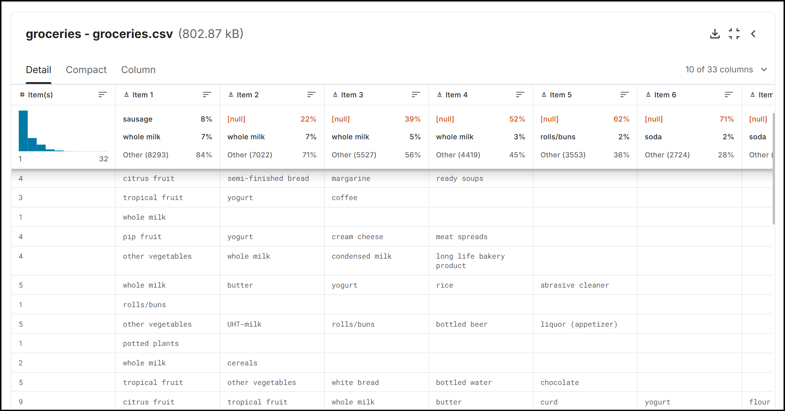
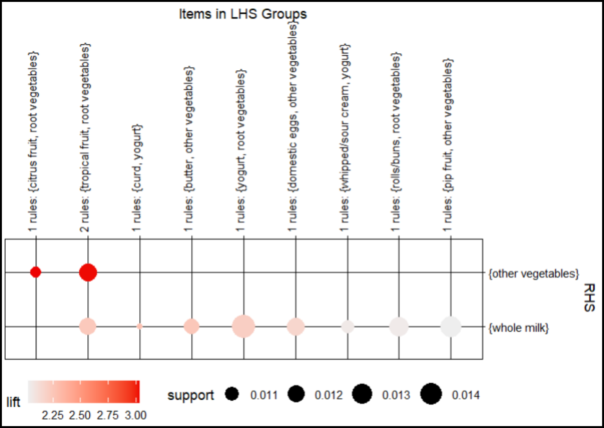
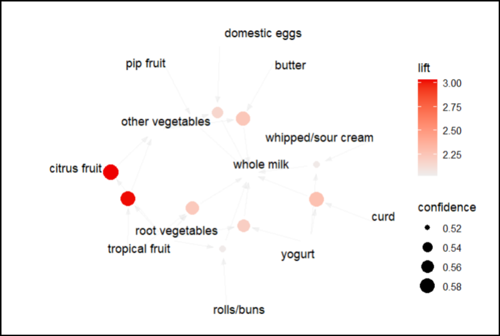

# “Pemodelan Pola Pembelian Produk pada Dataset Groceries dengan Teknik Association Rules di R Studio”

# About Projek
Projek ini menggunakan dataset dari Kaggle dan menerapkan algoritma Association Rules, khususnya Apriori, untuk menganalisis data transaksi. Analisis mencakup preprocessing data, pembuatan aturan asosiasi, dan visualisasi hasil dalam bentuk grafik dan matriks. Tujuan proyek ini adalah untuk mengidentifikasi pola asosiasi antara item dalam data transaksi.

# About Dataset
### Groceries Market Basket Dataset
Groceries Market Basket Dataset adalah kumpulan data yang mencatat transaksi belanja di sebuah supermarket. Dataset ini berisi informasi mengenai item yang dibeli bersama dalam satu keranjang belanja, yang sering digunakan untuk analisis pola pembelian dan rekomendasi produk. Dataset berisi 9835 transaksi pelanggan berbelanja bahan makanan. Data berisi 169 item unik.

Link Dataset: https://www.kaggle.com/datasets/irfanasrullah/groceries 

 

# About Algoritma
### Association Rule
Algoritma Association Rule adalah teknik dalam data mining yang digunakan untuk menemukan pola asosiasi atau hubungan antara item dalam dataset. Algoritma ini, seperti Apriori, bekerja dengan menganalisis data transaksi untuk mengidentifikasi item yang sering muncul bersama. Hasil dari analisis ini adalah aturan asosiasi yang dapat membantu dalam pengambilan keputusan, seperti rekomendasi produk dalam e-commerce. Algoritma ini umumnya melibatkan dua langkah utama: menemukan itemset yang sering muncul dan menghasilkan aturan yang kuat berdasarkan metrik seperti support, confidence, dan lift.

Package yang digunakan:
- Arules
- ArulesViz

# About Step
Langkah yang dilakukan dalam proses analisis:

- Import Data
- Data Preprocessing
- Read Transaction
- Visualisasi Dataset
- Algoritma Association Rule
- Visualisasi Hasil

# Hasil Analisis
Hasil dari analisis ini dijadikan plot berdasarkan nilai lift > 1,5. Dalam association rules, nilai lift memiliki arti:

- Lift < 1 : A dan B muncul bersama kurang dari yang diharapkan; ada hubungan negatif.
- Lift = 1 : A dan B muncul independen; tidak ada hubungan.
- Lift > 1 : A dan B sering muncul bersama; ada hubungan positif.

Plot menggunakan package ArulesViz:
 
 
