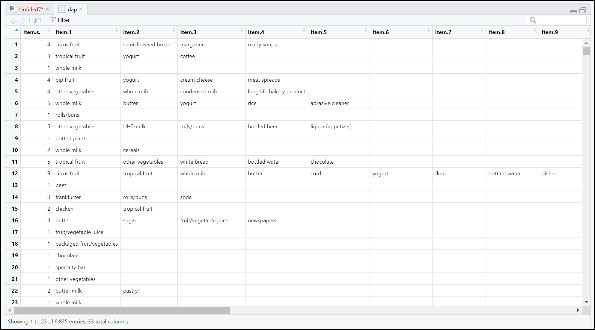

# Analisis Data Groceries dengan "Association" Rules RStudio
## Import Data & Membaca Data
Dataset yang sudah didownload dalam  bentuk csv akan disimpan dalam variabel "dap" menggunakan function read.csv.

"View" berfungsi untuk menampilkan data di jendela terpisah, bukan menjadi output pada console, sehingga data lebih mudah dilihat. Dengan "View" juga kita dapat melihat jumlah kolom beserta jumlah keseluruhan data.

```r
dap <- read.csv("C:/..../groceries.csv", header = TRUE)
View(dap)
```

#### Output
 

## Data Preprocessing
Pada tahap ini, kita akan menghapus kolom pertama yang hanya berisi jumlah item per barisnya, sehingga tidak dibutuhkan dalam proses analisis. Untuk mengecek apakah kolom sudah terhapus, kita menggunakan fungsi "View" seperti tadi.

```r
# DATA PREPROCESSING #
# Buang kolom 'Item(s)' jika tidak diperlukan
dap <- dap[, -1]
View(dap)
```

## Read Transaction
Lanjuuuut, ditahap ini kita akan mengubah dataset yang kita punya menjadi data transaksi menggunakan package "arules".

Kita bahas sedikit code nya
- na.omit : ini buat menghapus elemen NA (missing values) dari baris tersebut
- unique(...) : ini buat mengembalikan elemen-elemen yang unik dari baris, menghilangkan duplikasi
- paste(..., collapse = ",") : ini buat gabungin elemen yang unik menjadi satu string & dipisah pake koma (,)
- Groceries <- read.transactions : ini buat baca data ke tipe transaction dan disimpen ke variabel "Groceries"

```r
# Mengubah format data ke bentuk transaksi
# Menggabungkan semua item dalam satu baris transaksi
basket_data <- apply(dap, 1, function(row) paste(unique(na.omit(row)), collapse = ","))

# Simpan data ke file dalam format yang benar untuk transaksi (setiap transaksi di satu baris)
writeLines(basket_data, "groceries_basket.csv")
View(basket_data)

# Membaca data dalam format transaksi (basket)
library(arules)
Groceries <- read.transactions("groceries_basket.csv", format = "basket", sep = ",")
View(Groceries)
```

#### Output
