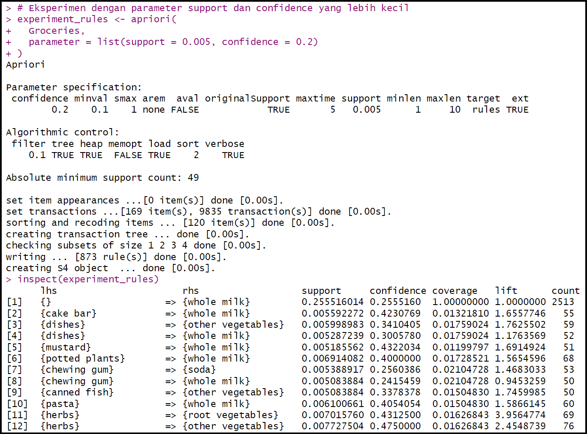
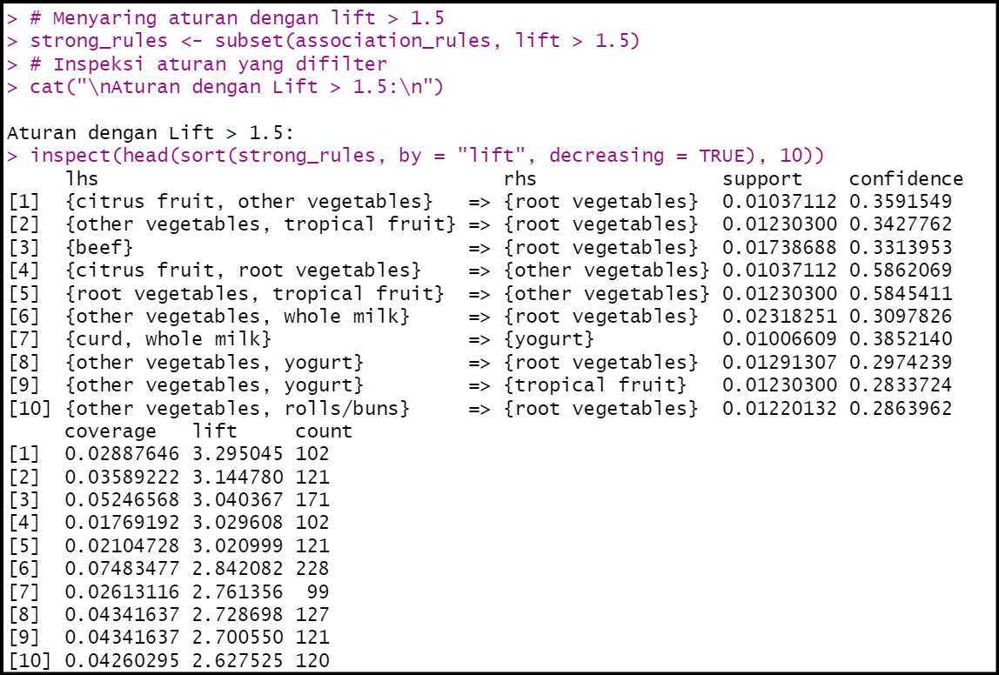
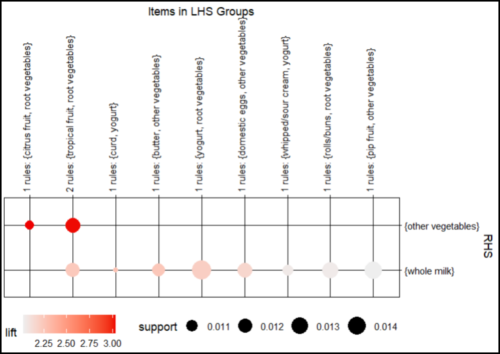
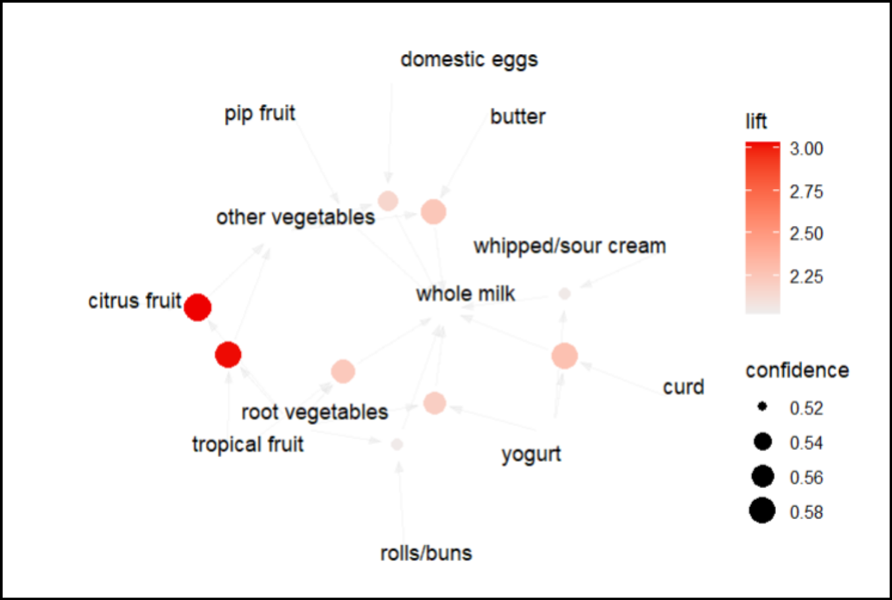

# Analisis Data Groceries dengan "Association" Rules RStudio 
## Buat Rules dengan Apriori
Sekarang kita akan membuat rules menggunakan algoritma Apriori. Kita pake nilai support 0,01 dan confidence 0,25.

Oke, kita bahas sedikit kenapa milih nilai support dan confidence nya segitu?? :
- Support = 0.01 : kita tetap dapat menemukan item yang kurang populer tetapi mungkin memiliki hubungan menarik.
- Confidence = 0.25 : jika confidence terlalu tinggi (misalnya 0.8), hanya aturan sangat kuat yang akan muncul, dan bisa melewatkan pola menarik lainnya.

Nah "inspect" ini berfungsi buat menampilkan hasil dari objek association_rules.

```r
# Membuat Rules menggunakan algoritma Apriori
association_rules <- apriori(
  Groceries,
  parameter = list(support = 0.01, confidence = 0.25)
)
inspect(association_rules)
```

#### Output
Dari output berikut dapat dilihat jumlah rules yang dihasilkan, yaitu 171 rule beserta nilai support, confidence, coverage, lift, dan count.


## Eksperimen dengan nilai support & confidence lebih kecil
Kita bahas kenapa milih nilai support dan confidence nya segitu?? :
- Support = 0.005 : aturan dengan item yang jarang muncul (tapi mungkin menarik) tetap akan dipertimbangkan.
- Confidence = 0,2 : hubungan antara LHS dan RHS cukup lemah karena confidence-nya rendah.
  
```r
# Eksperimen dengan parameter support dan confidence yang lebih kecil
experiment_rules <- apriori(
  Groceries,
  parameter = list(support = 0.005, confidence = 0.2)
)
inspect(experiment_rules)
```

#### Output
Nah, kalo dari output eksperimen ini tuh beberapa ada rule yang punya nilai lif < 1, beda sama rule sebelumnya yang cuma menghasilkan 1 rule dengan lift < 1.



## Mengambil 10 Rule Terbaik
OKe ini step udah mau selesai, kita bahas sedikit :
- strong_rules <- subset(...) : Memilih aturan dari association_rules yang memiliki nilai lift lebih besar dari 1.5.
- top_rules <- head(sort(...): Mengurutkan semua aturan dalam association_rules berdasarkan nilai confidence secara menurun dan mengambil 10 aturan teratas.

```r
# Menyaring aturan dengan lift > 1.5
strong_rules <- subset(association_rules, lift > 1.5)

# Inspeksi aturan yang difilter
cat("\nAturan dengan Lift > 1.5:\n")
inspect(head(sort(strong_rules, by = "lift", decreasing = TRUE), 10))

# Mengambil beberapa aturan terbaik berdasarkan confidence
top_rules <- head(sort(association_rules, by = "confidence", decreasing = TRUE), 10)
```

#### Output


## Visualisasi Hasil
Ini diaaa step akhir dari association rule kami, untuuk bisa melihat dengan visual hasil dari analisis data.

```r
# Visualisasi grouped matrix
plot(top_rules, method = "grouped")

# Visualisasi aturan dengan graph
plot(top_rules, method = "graph", measure = "confidence", shading = "lift")
```

#### Output
Hasil dari analisis ini dijadikan plot berdasarkan nilai lift > 1,5. Dalam association rules, nilai lift memiliki arti:

- Lift < 1 : A dan B muncul bersama kurang dari yang diharapkan; ada hubungan negatif.
- Lift = 1 : A dan B muncul independen; tidak ada hubungan.
- Lift > 1 : A dan B sering muncul bersama; ada hubungan positif.

Plot menggunakan package ArulesViz:

- Plot Berdasarkan Lift dan Support



- Plot Berdasarkan Lift dan Confidence


