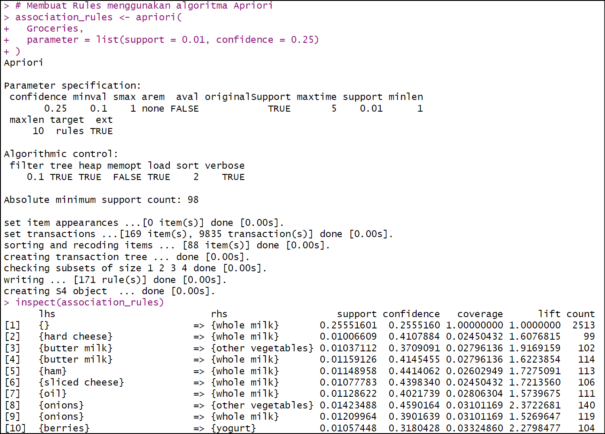

# Analisis Data Groceries dengan "Association" Rules RStudio 
## Buat Rules dengan Apriori
Sekarang kita akan membuat rules menggunakan algoritma Apriori. Kita pake nilai support 0,01 dan confidence 0,25.

Oke, kita bahas sedikit kenapa milih nilai support dan confidence nya segitu?? :
- Dengan support = 0.01, kita tetap dapat menemukan item yang kurang populer tetapi mungkin memiliki hubungan menarik.
- Jika confidence terlalu tinggi (misalnya 0.8), hanya aturan sangat kuat yang akan muncul, dan bisa melewatkan pola menarik lainnya.

Nah "inspect" ini berfungsi buat menampilkan hasil dari objek association_rules.

```r
# Membuat Rules menggunakan algoritma Apriori
association_rules <- apriori(
  Groceries,
  parameter = list(support = 0.01, confidence = 0.25)
)
inspect(association_rules)
```

#### Output
Dari output berikut dapat dilihat jumlah rules yang dihasilkan, yaitu 171 rule beserta nilai support, confidence, coverage, lift, dan count.



## Eksperimen dengan nilai support & confidence lebih kecil
